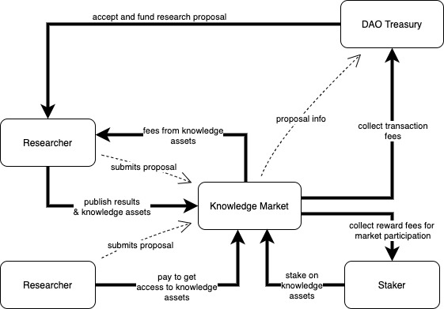
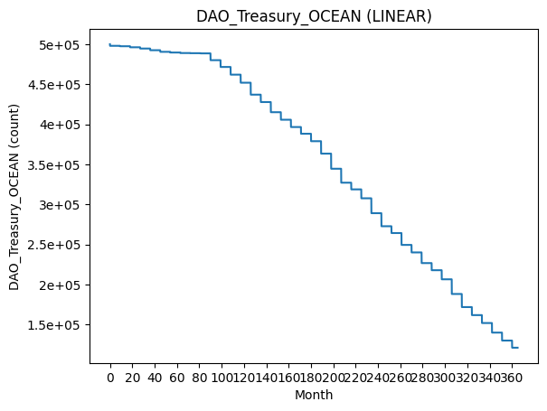
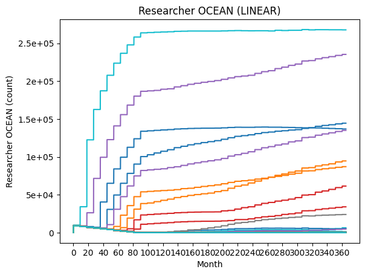
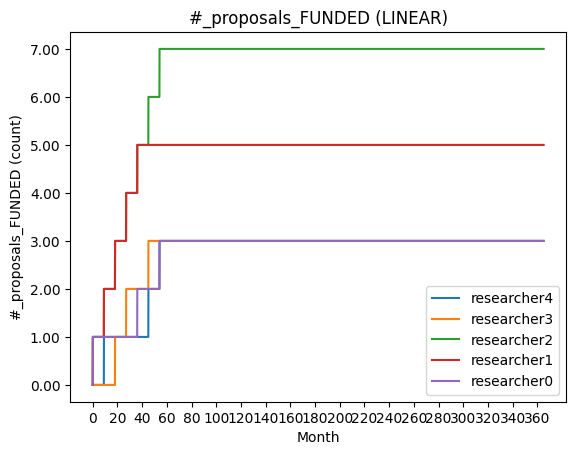
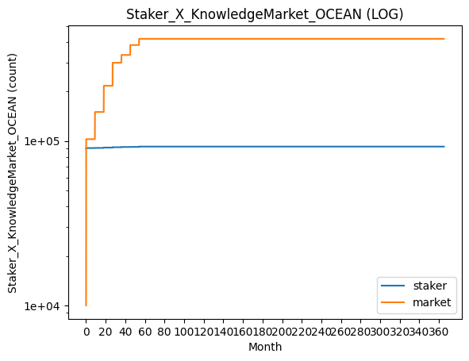
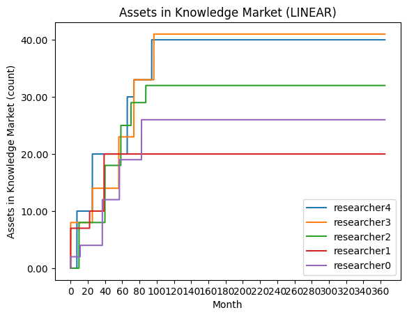
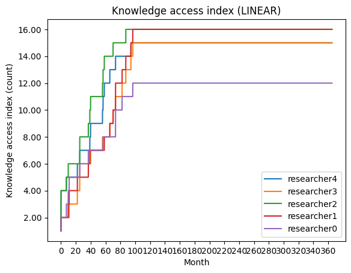

# Model #2 Profit-sharing (simple, mult, mult-time)

Note: this README contains summaries of `opsci_profit_sharing/`, `opsci_mult_profit_sharing/`, and `opsci_mult_time_profit_sharing/` netlists, respectively.

## #2.1 Simple Profit Sharing Model

This model is the simplest representation of how a web3 scientific ecosystem could function. Essentially, it is a variation of the [Web3 Sustainability Loop](https://blog.oceanprotocol.com/the-web3-sustainability-loop-b2a4097a36e) where researchers are still competing for funding from an exhaustible funding agency, but instead of publishing their results to centralized knowledge curators, they publish to the web3 knowledge market, which allows them to retain ownership of their data, articles, algorithms, etc. whilst still sharing your work with the scientific community.

schema of the web3 profit sharing model

web3 sustainability loop

The knowledge market allows researchers to publish their results at any stage of their research, so naturally, it is also the perfect place to get all the necessary resources for research. 

## #2.2 Profit-sharing with multiple proposals funded at a time

From the simulation with 100 researchers, it seems to be clear that funding one proposal at a time is not realistic in a scientific community that is larger than a couple of researchers. This model enables an arbitrary number of proposals funded at a time,

As expected, this model yields similar results to the simple profit-sharing model, only this time the treasury is depleted much sooner. In the plots above, 5 researchers are competing for 3 proposals and all researchers are funded at least once. It is no surprise that the profit-sharing aspect of the model doesn't make much of a difference since all the funds are disbursed too quickly and the fees are too small.

## #2.3 Profit-sharing with rolling basis funding

With the introduction of multiple proposals at a time, the next reasonable step is to remove the fixed funding periods. This was achieved by adding a new time parameter to the `proposal` that researchers submit indicating how long their research project is going to take. This time parameter is also used in the evaluation of proposals by the Treasury (shorter projects are favored over longer ones). Now, at the start of the simulation, a number of projects are funded and as they finish at different times, new projects are funded immediately.

Note, since we have multiple proposals funded at a time, the Treasury is still being depleted quite quickly, however, we can see that all researchers have been funded and they have been receiving appropriate rewards for their research. In this model, the knowledge access index is no longer in synch across researchers. The reason for that is that when a researcher is not funded, there are suddenly multiple research projects that they can buy into to gain **a higher knowledge access index than if they were funded**. This means that once a project finished, the researcher that wasn't funded has a higher chance of getting funded than the researcher who was funded previously, and each time a researcher is not funded, their chances increase significantly. In other words, in the 5 researcher, 3 proposals at a time simulation shown above, the probability that one researcher would not get funded at least once is very close to 0.

### Limitations

This model inevitably has some limitations. Firstly, it is hard to say whether having a guarantee of getting funded at some point is desirable. While it ensures a fair competition, we are also assuming the researchers are all doing research of comparable quality and importance and that no researchers have malicious incentives.